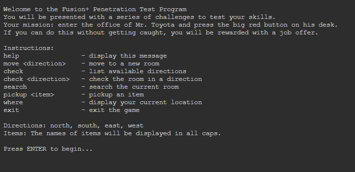

# Fusion+ Penetration Test Program
The year is 2047, and you have been paid by the mega corporation Fusion+ to perform a security audit of their Toyota building. This means walking into the building and trying to get access to top secret information – a designated button in Mr. Toyota’s office is your target. You wander around, collecting items for a janitor costume. When you are done, you enter Mr. Toyota’s office and grab the red “flag” button, failing the company on the security audit.

This button is your villain.

Requires Python to run. Developed on 3, might work on 2.
